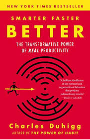
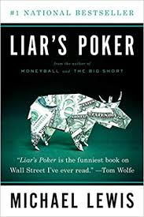
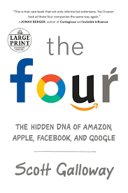
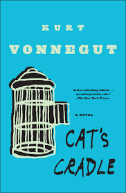
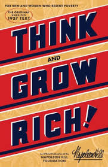
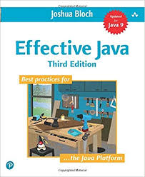

One of my favorite things about the summers is how much time I have to catch up on reading. Admittedly I have more fun reading at home than in the crowded F train to Manhattan, but I worked with what I had this summer. Over the course of the summer, I read 6 books, and I want to share my experience with each of them, in the order that I read them. Here it goes:

## _Smarter, Faster, Better_ by Charles Duhigg

I read one of Duhigg's other books, _The Power of Habit_, and I loved it so much that I just had to buy his new book. It did not disappoint. His description of productivity and the tools he gives to enhance day-to-day output are unparalleled. 

Duhigg does an amazing job of giving real-world examples of situations, and showing how people apply his principles to become more productive people. More than just a productivity guide, though, this book also describes how effective teams function together and how people can best internalize information.

**Biggest Takeaway**: His chapter on internalizing information really stuck with me, because I'm a firm believer in lifelong learning. He talks about the importance of not only _receiving_ information, but _immediately applying it_ to a real-world situation:

> The people who are most successful at learning... are the ones who know how to use disfluency to their advantage. They transform what life throws at them, rather than just taking it as it comes. (264)

As I try to advance in my career, having the ability to really internalize large amounts of information will prove extremely useful, and I owe it to Duhigg for helping me learn ways to do that.

Find this book on [Amazon](https://www.amazon.com/Smarter-Faster-Better-Transformative-Productivity/dp/0812983599/ref=sr_1_3?crid=3VE58XKTHXWD9&keywords=smarter+faster+better&qid=1565898014&s=books&sprefix=smarter+faster%2Cstripbooks%2C159&sr=1-3).

## _Liar's Poker_ by Michael Lewis

For those that don't know Michael Lewis, he wrote such books-turned-movies as _Moneyball_ and _The Big Short_. He is an extremely gifted storyteller known for his incredibly engaging descriptions of real world events. 

In _Liar's Poker_, he takes a turn and writes a book about his own experience on Wall Street in the 80's. He worked for [Salomon Brothers](https://en.wikipedia.org/wiki/Salomon_Brothers), one of the biggest firms at the time. Throughout the book, he weaves his own experiences in with vivid descriptions of how Salomon Brothers worked internally. They are quite unflattering descriptions. 

A large part of the book centers around the training sessions that all new traders had to endure (note use of the word "endure") before making their way onto the floor. Lewis could not believe how childish some of his colleagues were; they were often caught throwing paper balls at the lecturers. He also includes a lot of technical economic jargon, but tries to explain it in a way that anybody could digest.

**Biggest Takeaway**: Wall Street was, and always will be, a cutthroat environment. Traders have little to no regard for their customers, and often try to f*ck them over (as Lewis did to one Frenchman - read the book to find out). However, some people are just always meant to be screwed over:

> You are proof that some people are born to be customers. (213)

Find this book on [Amazon](https://www.amazon.com/Liars-Poker-Norton-Paperback-Michael/dp/039333869X/ref=sr_1_1?crid=24LK8FCCXGZDX&keywords=liar%27s+poker&qid=1565899441&s=books&sprefix=liar%27s+poker%2Caps%2C157&sr=1-1).

## _The Four_ by Scott Galloway

Galloway, a professor at NYU, paints a not-so-pretty picture of four firms that have shaped our current way of life: Apple, Amazon, Facebook, and Google. He begins the book with a chapter on each of the four companies, each one seeming to get more and more critical. Fun fact: Amazon actually took this book off of their online store for a while. Yay for freedom of speech violations!

He then continues on to explain _why_ these companies do so well, and how they are going to continue to do even better. He also describes the potential outcome of letting these companies expand indeterminately, and what we can do to help. Finally, he ends with advice on how to succeed in a world where these companies dominate.

He mostly argues that, given the extreme amount of money that these firms have, they are morally wrong for not putting it to better use. For example, Amazon spents a huge amount on new innovative technologies each year, about 50% of which fail and are never mentioned or addressed ever again. What if Amazon put all of that money into the public education system? These are the kinds of arguments Galloway pounds home in this book.

One of my favorite arguments is in the Apple chapter, where he talks about the sex appeal that the company generates. It's unlikely that a $1000 iPhone is much better than an Android that is $400 cheaper, but people have come to idolize Apple products and see them as "sexy". Apple generates a colossal amount of revenue with this stigma. 

**Biggest Takeaway**: Yes, these companies have near-monopolies in their respective sectors, but they have carefully crafted these monopolies. They're extremely good at what they do, and unless we find another company that does e-commerce better than Amazon or search better than Google, we have to deal with what we've got.

> All successful businesses appeal to one of three areas of the body — the brain, the heart, or the genitals. (163)

Find this book (ironically) on [Amazon](https://www.amazon.com/Four-Hidden-Amazon-Facebook-Google/dp/0735213658/ref=sr_1_1?keywords=the+four&qid=1565900258&s=books&sr=1-1).

## _Cat's Cradle_ by Kurt Vonnegut

This is the lone fiction book I read this summer, and I absolutely loved it. I had read _Slaughterhouse-Five_ and _Breakfast of Champions_ before and loved them both, so I was sure that _Cat's Cradle_ would not disappoint, and it did not. 

The book follows the main protagonist Jonah as he looks to learn more about the creator of the atom bomb, Felix Hoenikker. He ends up travelling to the fictional San Lorenzo with Hoenikker's children Frank, Newton, and Angela. Their father also invented a substance called ice-nine, which turns any water that it touches into water immediately.

The book is largely an argument on war and the arms race, with subtle hints about religion. This book is a quick read and I highly recommend it to anyone.

**Biggest Takeaway**: anything can change in a moment's notice. Make sure to take everything all in while you still can.

Find this book on [Amazon](https://www.amazon.com/Cats-Cradle-Novel-Kurt-Vonnegut/dp/038533348X/ref=sr_1_2?keywords=cat%27s+cradle&qid=1565900661&s=books&sr=1-2).

## _Think and Grow Rich_ by Napoleon Hill

This book, along with _How to Win Friends and Influence People_ by Dale Carnegie, is considered one of the original self-help books. Written in 1937, this book contains a 12-step program toward achieving your financial goals.

To be honest, I was not a huge fan of this book. Hill takes finance from a very spiritual perspective, talking about "raising frequencies of thoughts" so that the "Infinite Intelligence" can receive them. He talks a lot about how to train your sub-conscious mind to receive better ideas.

Although, one point that I really appreciated was his argument about the necessity of having a _crystal clear_ vision of what you want. Saying "I want money" does not suffice; instead, try "I want money from creating a successful and profitable iPhone application that I will release in December of this year" (possible foreshadowing from Dylan???)

**Biggest Takeaway**: make a clear plan for creating the wealth that you desire. Read it to yourself every day, and never let it slip your mind. Get as specific as possible.

> The successful leader must plan his work, and work his plan. (128)

Find this book on [Amazon](https://www.amazon.com/Think-Grow-Rich-Publication-Foundation-ebook/dp/B07P896HSJ/ref=sr_1_1_sspa?crid=26DVSBZU7ABHL&keywords=think+and+grow+rich&qid=1565900683&s=books&sprefix=think+%2Cstripbooks%2C171&sr=1-1-spons&psc=1&spLa=ZW5jcnlwdGVkUXVhbGlmaWVyPUExODZBRUtKNTRPNERGJmVuY3J5cHRlZElkPUEwODM5MzY4VExDQUQxUzU1T1hWJmVuY3J5cHRlZEFkSWQ9QTAzMzkzNzhNSFRJRjZWTjFCMkkmd2lkZ2V0TmFtZT1zcF9hdGYmYWN0aW9uPWNsaWNrUmVkaXJlY3QmZG9Ob3RMb2dDbGljaz10cnVl).

## _Effective Java_ by Josh Bloch

This book needs no explanation. It's simply the best book out there on Java development, and is an absolutely necessity for anyone consistently using Java. He talks not only about design patterns, but also about common Java libraries and how to use them effectively. Please read this book.

**Biggest Takeaway**: Streams. Are. Awesome.

Find this book on [Amazon](https://www.amazon.com/Effective-Java-Joshua-Bloch/dp/0134685997/ref=sr_1_3?keywords=effective+java&qid=1565901196&s=books&sr=1-3).