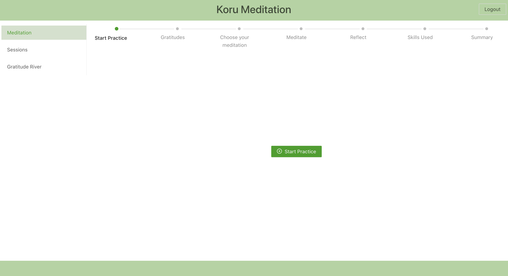
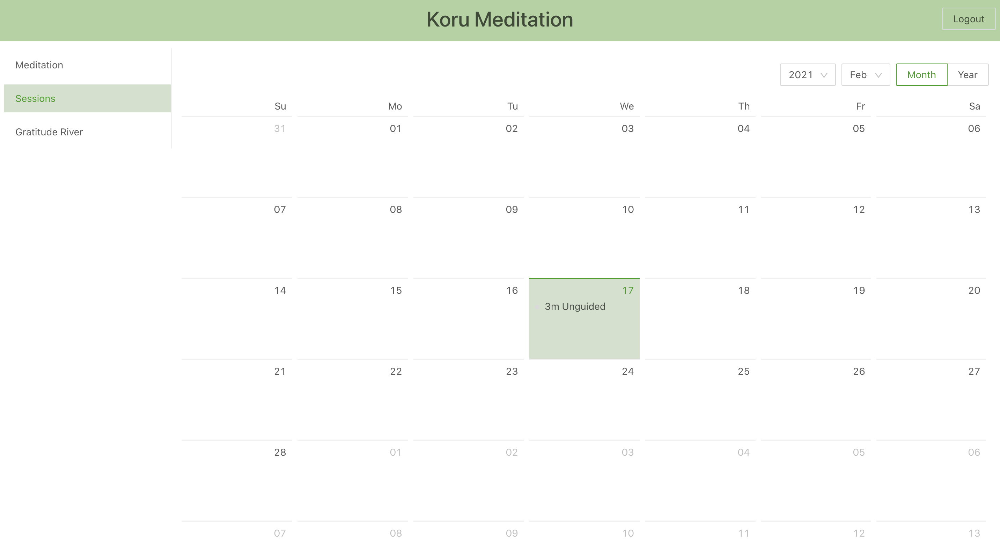
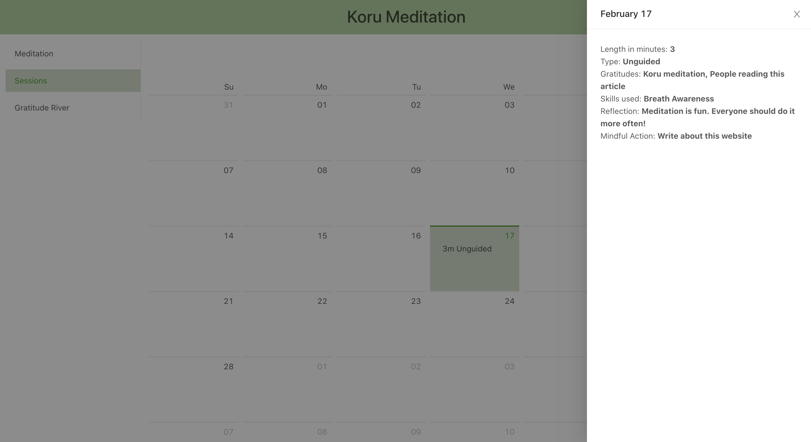
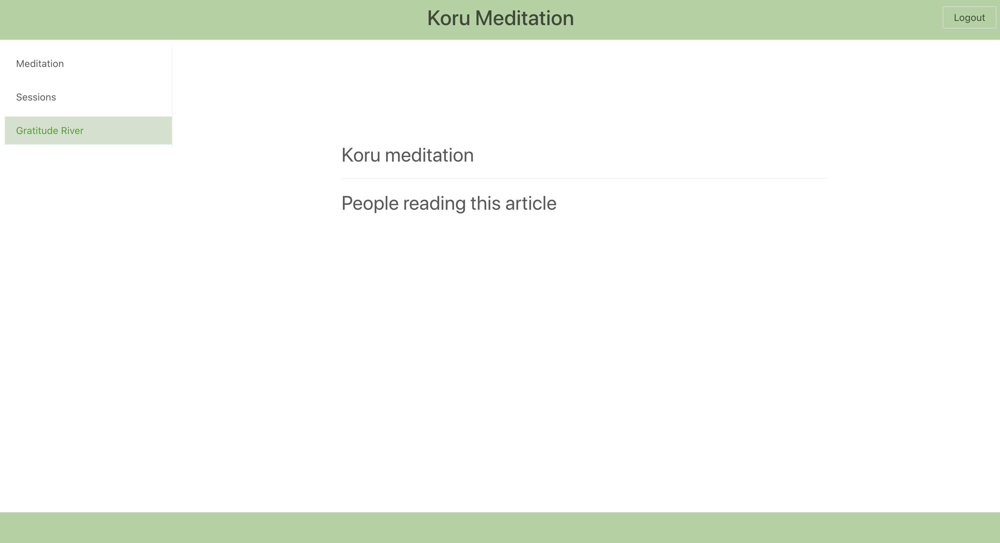

Find the website [here](http://www.korumeditation.com/).

This is a website much like the popular Koru Meditation app. I discovered [Koru](https://korumindfulness.org/) while a student at Duke University when I took a free four-session class to learn how to meditate with mindfulness. The app helped me to track my meditation sessions, and it was also stock-full of guided meditations. However, I grew tired of constantly having to use my phone, especially as I wanted to type more and more in my reflections.

So, I set out to make a website! The website has many of the same features as the app:

* The ability to run through a full meditation session. This involves writing down two gratitudes, selecting the meditation type and length, meditating, reflecting, selecting skills used and selecting a mindful action for the day. Here is the first stage:

* A calendar to track past meditation sessions. Each day may hold multiple sessions.

Additionally, when clicking on a session, a drawer will expand showing the details of that session.

* A gratitude river, which shows all public gratitudes in the last 24 hours. Users can choose to not show their gratitudes on the river by marking them as private.

The website also has an authentication system where users can sign up, log in, and log out. 

I built the website with the MERN stack ([MongoDB](https://www.mongodb.com/), [ExpressJS](https://expressjs.com/), [React](https://reactjs.org/), [Node.js](https://nodejs.org/en/)). It is hosted on [Heroku](https://heroku.com).

The frontend uses [Redux](https://redux.js.org/) for state management and [styled-components](https://styled-components.com/) for css-in-js styling. It also uses [Redux thunk](https://github.com/reduxjs/redux-thunk), an awesome library for dispatching asynchronous actions in Redux.

The backend uses [Passport](http://www.passportjs.org/) for identity management.

For more details look at [the code](https://github.com/dylandpowers/koru).